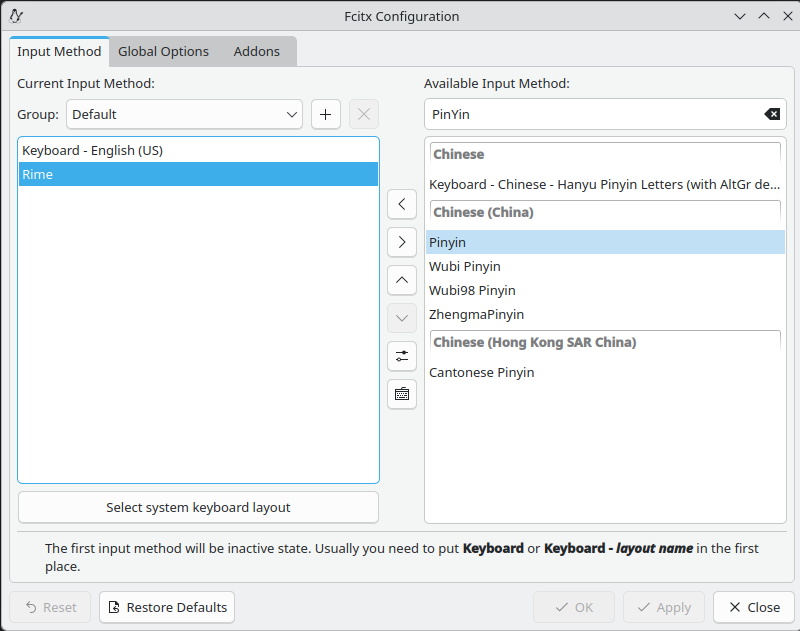

## 解决方案

在 Jetbrains 系列 IDE 上使用 fcitx5 时，可能会遇到无法切换输入法的问题。为了解决这个问题，可以尝试以下步骤：

1. 确保 fcitx5 已经正确安装并配置

   > 检查以下组件是否以安装完整

   ```text
   fcitx5 
   fcitx5-gtk 
   fcitx5-gtk2
   fcitx5-qt 
   fcitx5-configtool 
   fcitx5-chinese-addons
   fcitx5-rime librime-lua
   fcitx5-table-extra 
   fcitx5-zhuyin 
   kcm-fcitx5 
   fcitx5-m17n 
   qt5-qtbase
   qt5-qtwebkit 
   fcitx5-qt5
   ```

   > 完整安装命令

   ```bash
   sudo dnf install fcitx5 fcitx5-gtk fcitx5-gtk2 fcitx5-qt fcitx5-configtool fcitx5-chinese-addons fcitx5-rime librime-lua fcitx5-table-extra fcitx5-zhuyin kcm-fcitx5 fcitx5-m17n qt5-qtbase qt5-qtwebkit fcitx5-qt5
   ```

2. 配置 `locale` 信息

   > 这是关键的一步，不配置的话打死都无法在 IDE 中切换输入法

   ```bash
   # 查看当前配置
   locale -a
   
   # 查询当前状态
   localectl status
   
   # 配置为中文编码
   sudo localectl set-locale LANG=zh_CN.UTF-8
   sudo localectl set-locale LC_CTYPE=zh_CN.UTF-8
   ```
3. 设置环境变量为 `fcitx5`

   > 在 `~/.bash_profile` 中添加以下配置

   ```shell
   # fcitx5
   export XIM=fcitx
   export XMODIFIERS=@im=fcitx
   export GTK_IM_MODULE=fcitx
   export QT_IM_MODULE=fcitx
   ```
4. 配置中文输入法

   运行 `fcitx5-configtool` 或者 `fcitx5-config-qt` 后添加中文输入法，比如：`PinYin`、`Rime` 等

   
5. 配置虚拟键盘

   在 `Keyboard` 系统配置中选择 `Virtual Keyboard` 为 `Fcitx 5` 或者 `Fcitx 5 Wayland Launcher xxx`

   
6. 重启系统~

----

> 如果以上步骤仍然无法解决问题，请自行 `Google`

## 参考资料

- [fcitx5 官方文档](https://fcitx-im.org/wiki/Fcitx5)
- [Jetbrains 官方文档](https://www.jetbrains.com/help/idea/switching-input-methods.html)
